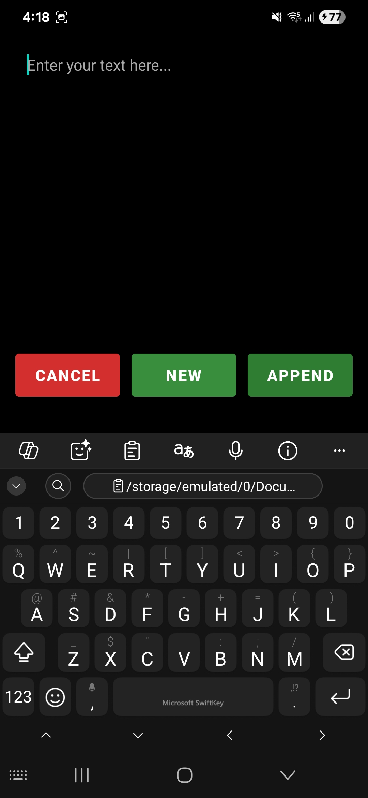
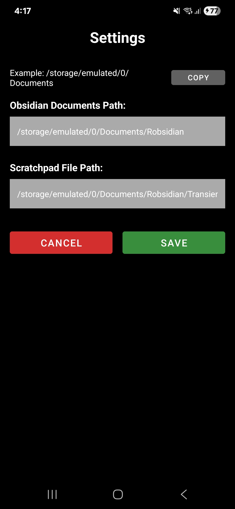

# ObsQuickCapture Android App

A simple Android application for quickly capturing text and saving it to Obsidian vault files.



This was generated with help from Claude Code.

## Features

- **Quick Text Input**: Large, scrollable text area with auto-focus
- **New File Creation**: Save text to timestamped markdown files (`yyyy-MM-dd HHmm.md`)
- **Append to Scratchpad**: Add text to a persistent scratchpad file
- **Share Target**: Receive shared text from other Android apps

## File Locations

Files are stored in app-specific external storage (special permissions required):
The locations are configurable. New files are expecting a folder in your Obsidian vault,
the append to file is expected to be an existing markdown file. I typically create new files in
the folder I use as my obsidian inbox, and I have a scratchpad.md file permaently pinned in the
right hand sidebar. You access the config by long-pressing the "Cancel" button. Paths to internal
storage can be fiddly so it displays the documents folder for reference.



## Building the App
Build in Android Studio

### Prerequisites

1. **Android Studio Narwhal** (or newer)
2. **Java 8+** installed
3. **Android SDK** with API level 34

### Build Steps

1. Open Android Studio
2. Select "Open an existing Android Studio project"
3. Navigate to `c:\MyCode\ObsQuickCap` and open the project
4. Wait for Gradle sync to complete
5. Connect your Samsung Galaxy S23 or use an Android 15 emulator
6. Click the "Run" button or press Shift+F10

### Build from Command Line (Windows)

```cmd
cd c:\MyCode\ObsQuickCap
gradlew.bat assembleDebug
```

The APK will be generated in `app\build\outputs\apk\debug\`

## App Usage

### Direct Launch
1. Open the ObsQuickCapture app
2. Type your text in the large input area
3. Choose an action:
   - **Cancel**: Close without saving
   - **New file**: Save to a timestamped file
   - **Append**: Add to scratchpad file

### Share Target
1. In any app, select text and choose "Share"
2. Select "ObsQuickCapture" from the share menu
3. The text will be pre-populated in the input field
4. Choose your desired action

## Technical Details

- **Target SDK**: Android 14 (API 34)
- **Minimum SDK**: Android 8.0 (API 26)
- **Language**: Kotlin
- **Storage**: Uses scoped storage (Android 11+) and legacy external storage (Android 10-)
- **Permissions**: Only requests storage permissions for Android 10 and below

## File Structure

```
ObsQuickCap/
├── app/
│   ├── src/main/
│   │   ├── java/com/obsidian/quickcapture/
│   │   │   └── MainActivity.kt          # Main app logic
│   │   ├── res/
│   │   │   ├── layout/
│   │   │   │   └── activity_main.xml    # UI layout
│   │   │   ├── values/
│   │   │   │   ├── colors.xml           # Color definitions
│   │   │   │   ├── strings.xml          # Text resources
│   │   │   │   └── themes.xml           # App themes
│   │   │   └── mipmap-*/
│   │   │       └── ic_launcher.png      # App icon
│   │   └── AndroidManifest.xml          # App configuration
│   └── build.gradle                     # App build configuration
├── gradle/wrapper/                      # Gradle wrapper files
├── build.gradle                         # Project build configuration
├── settings.gradle                      # Project settings
└── README.md                           # This file
```

## Code Comments

The code is extensively commented for educational purposes. Key areas include:

- **File operations**: How to work with Android scoped storage
- **Intent handling**: Processing shared text from other apps
- **UI setup**: Creating a responsive layout that works with the on-screen keyboard
- **Permission handling**: Managing storage permissions across Android versions

## Troubleshooting

### Storage Issues
- Ensure your device has sufficient storage space
- Check that the target folder is accessible
- For Android 10 and below, verify storage permissions are granted

### Build Issues
- Ensure Android Studio is using Java 8+
- Clear and rebuild: Build → Clean Project, then Build → Rebuild Project
- Check that all dependencies are downloaded

### App Crashes
- Check device logs in Android Studio's Logcat
- Verify target device is running Android 8.0 or higher
- Ensure proper permissions are granted
